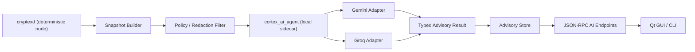

# Cortex AI Provider Design

## Scope

This document defines the concrete AI provider architecture for `cortex_project` using:

- Google Gemini API
- Groq API

It also defines the hard boundary that prevents the intelligence layer from touching consensus.

This document is based on the school whitepaper's Intelligent Operations Subsystem and should be read together with:

- [`/Users/gitanshchakravarty/Desktop/cortex_project/docs/CORTEX_AI_ARCHITECTURE_PLAN.md`](./CORTEX_AI_ARCHITECTURE_PLAN.md)
- [`/Users/gitanshchakravarty/Desktop/cortex_project/docs/communication-systems.md`](./communication-systems.md)

## Design Goal

The AI layer is not the protocol.

The AI layer is an operator-assistance system that:

- reads validated and redacted state
- produces typed advisory outputs
- explains operational conditions
- suggests actions to the user

The AI layer must not:

- validate blocks
- validate transactions
- calculate difficulty
- approve balances
- sign transactions
- submit blocks
- broadcast transactions
- mutate wallet or chain state

## Why Gemini And Groq Together

As of July 16, 2026:

- Google recommends the Gemini Interactions API for new Gemini integrations.
- Groq exposes an OpenAI-compatible API surface, with Chat Completions as the stable baseline and Responses API available in beta.

That makes the split straightforward:

- Gemini for deeper reasoning, longer-context explanations, and multi-step advisory workflows
- Groq for low-latency structured scoring and frequent dashboard-style classifications

## Provider Roles

### Gemini Role

Gemini should be the higher-context reasoning engine for:

- blockchain activity interpretation
- communication incident summarization
- operator-facing explanations
- protocol and whitepaper Q&A
- long-form mining or network diagnostics

Gemini is the better fit for:

- multi-turn context
- structured outputs
- function calling against local read-only tools
- optional background tasks

### Groq Role

Groq should be the low-latency classifier for:

- transaction-risk scoring
- network health scoring
- mining anomaly triage
- mail abuse/spam heuristics
- fast UI refresh recommendations

Groq is the better fit for:

- frequent small advisory calls
- strict JSON schema output
- very fast classification loops
- predictable dashboard refresh behavior

## External API Choices

### Gemini APIs We Should Use

Primary:

- Gemini Interactions API

Reasons:

- officially recommended for new projects
- supports structured output
- supports function calling
- supports multi-turn workflows
- supports optional background execution

Recommended Cortex usage:

- stateless calls by default
- `store=false` for runtime advisory requests
- structured JSON output for all machine-consumed responses
- local function calling only

Optional Gemini APIs:

- `embedContent` for static, non-sensitive document embeddings

Use this only for:

- public protocol docs
- school whitepaper
- communication design docs

Do not use it for:

- wallet data
- live peer graphs with raw IPs
- mail contents by default
- transaction drafts containing sensitive metadata

Avoid by default:

- Gemini built-in web search for wallet, peer, or chain telemetry
- Gemini server-side file indexing for sensitive local runtime data

### Groq APIs We Should Use

Primary:

- Chat Completions API at the OpenAI-compatible base URL

Reasons:

- stable baseline
- easy SDK compatibility
- supports structured outputs
- supports tool use when needed

Recommended Cortex usage:

- JSON schema outputs for all structured classification
- `strict: true` when model support exists
- local tool calling only if tools are needed
- no built-in web tools for sensitive workflows

Optional Groq API:

- Responses API behind a feature flag

Reason:

- it is useful for future stateful conversations and function calling
- but official docs describe it as beta today

## Provider Safety Policy

### Gemini Safety Policy

Allowed:

- local read-only function calls
- structured outputs
- protocol explanation over public docs
- explicit user-triggered grounding for public facts

Blocked:

- direct wallet actions
- direct node actions
- automatic use of Google Search on sensitive runtime prompts
- uploading private runtime state without explicit opt-in

### Groq Safety Policy

Allowed:

- structured classification
- local read-only tool calls
- typed summaries
- dashboard scoring

Blocked:

- Groq built-in tools for autonomous browsing or code execution on node state
- remote MCP execution against sensitive internal systems
- any tool flow that can write into wallet, chain, config, or peer state

## Consensus Firewall

This is the most important implementation rule.

The AI layer should sit behind a dedicated "consensus firewall" with these properties:

### 1. Separate Process Boundary

Run the provider adapter and model orchestration in a separate local process, for example:

```text
cryptexd  <->  cortex_ai_agent
```

Do not embed provider SDK calls directly into consensus-critical validation paths.

### 2. Read-Only Snapshot Input

The AI process receives only typed snapshots such as:

- network snapshot
- mining snapshot
- wallet risk snapshot
- communication snapshot
- protocol doc context

It does not get:

- mutable chain handles
- mempool mutation handles
- wallet private keys
- wallet passwords
- raw signing primitives
- block acceptance hooks

### 3. No Direct Action RPC

The AI process must not be allowed to call:

- `sendtoaddress`
- `submitblock`
- `setgenerate`
- any wallet open/close/delete method
- any peer add/drop/ban method
- mail policy mutation RPCs
- config mutation RPCs

If the model suggests an action, the GUI or CLI presents that recommendation to the user, and the existing deterministic code path executes it later only after explicit approval.

### 4. Typed Output Validation

All model outputs must be validated against local JSON schemas before use.

If validation fails:

- discard the result
- mark the advisory as failed
- never fall back to "best guess" parsing for action-related flows

### 5. Human In The Loop

Any flow with operational effect stays human-confirmed:

- transaction send
- mining setting changes
- contact trust changes
- mail security changes
- peer policy changes

## Recommended Runtime Topology



## Internal APIs We Need

### In-Process C++ Snapshot Interfaces

The daemon should expose internal read-only collectors such as:

- `collect_network_snapshot()`
- `collect_mining_snapshot()`
- `collect_wallet_risk_snapshot()`
- `collect_chain_activity_snapshot()`
- `collect_comms_snapshot()`

These should return plain data objects only.

### Sidecar Transport

The cleanest cross-platform sidecar transport is:

- stdio JSON messages between `cryptexd` and `cortex_ai_agent`

Why stdio:

- no extra local ports
- simpler Windows packaging
- clear process ownership
- easy to restrict

Use message types such as:

- `analyze.network_health`
- `analyze.tx_risk`
- `analyze.mining`
- `analyze.comms`
- `summarize.chain_activity`
- `explain.protocol_topic`

### User-Facing JSON-RPC Methods

Expose only advisory endpoints to GUI and CLI:

- `getintelligenceoverview`
- `getnetworkhealthreport`
- `analyzetransactionrisk`
- `getminingadvice`
- `getactivitysummary`
- `getcommssecurityreport`
- `explainprotocoltopic`

Do not expose raw provider prompts or provider credentials over RPC.

## Redaction Rules Before Provider Calls

### Never Send

- wallet passphrases
- private keys
- seed phrases
- raw key material
- full unredacted local filesystem paths

### Send Only If Explicitly Enabled

- mail body contents
- private chat message contents
- full transaction memo or note text
- raw peer IP addresses

### Default Redaction Strategy

- hash or truncate peer IPs
- strip wallet labels unless needed
- replace raw addresses with role tags when possible
- summarize transaction graphs locally before provider submission
- use numeric telemetry instead of raw logs where possible

## Task Split Between Gemini And Groq

### Gemini Tasks

- `explainprotocoltopic`
- `summarize.chain_activity`
- `summarize.communication_incident`
- `explain.transaction_risk`
- `explain.mining_state`

### Groq Tasks

- `score.transaction_risk`
- `score.network_health`
- `score.mail_abuse_risk`
- `score.mining_anomaly`
- `classify.sync_state`

## Output Schemas We Need

Every provider result should normalize into local types.

### AdvisoryResult

```json
{
  "kind": "network_health",
  "provider": "groq",
  "generated_at": "2026-07-16T00:00:00Z",
  "severity": "medium",
  "confidence": 0.81,
  "score": 63,
  "summary": "Peer diversity is low and sync confidence is weak.",
  "reasons": [
    "validated peer count is zero",
    "best peer height is stale",
    "LAN-only discovery pattern observed"
  ],
  "recommendations": [
    "connect to a trusted peer",
    "delay large sends until sync confidence improves"
  ],
  "evidence": {
    "validated_peers": 0,
    "connections": 1,
    "best_peer_height": 10,
    "local_height": 10
  }
}
```

### TransactionRiskResult

```json
{
  "kind": "tx_risk",
  "provider": "groq",
  "severity": "high",
  "confidence": 0.9,
  "score": 84,
  "reasons": [
    "unusually large transfer relative to prior history",
    "new recipient pattern"
  ],
  "recommendations": [
    "verify recipient out-of-band",
    "consider test transaction first"
  ]
}
```

## Implementation Order

### Step 1

Build the local snapshot and schema system with no external AI providers.

### Step 2

Add Groq first for low-latency scoring:

- network health
- tx risk
- mining anomaly
- communication risk

### Step 3

Add Gemini for richer explanations:

- protocol assistant
- long-form incident summaries
- background activity summaries

### Step 4

Add explicit opt-in controls for sending sensitive content to remote providers.

## Concrete Recommendation

For the first real Cortex AI implementation:

- keep all deterministic rules in `cryptexd`
- launch a local `cortex_ai_agent` sidecar
- use Groq Chat Completions with strict JSON schema outputs for fast scoring
- use Gemini Interactions API with `store=false` for deeper reasoning and explanations
- keep all provider calls behind read-only local tool definitions and redaction filters

That gives us an AI-assisted architecture that matches the whitepaper without contaminating consensus.

## Verified Provider Notes

As checked on July 16, 2026:

- Gemini Interactions API is GA and recommended for new Gemini work.
- Gemini supports structured output and function calling in the Interactions API.
- Gemini File Search exists, but should be reserved for non-sensitive documentation workflows in Cortex.
- Groq Chat Completions is part of the OpenAI-compatible API surface.
- Groq Responses API exists but is currently documented as beta.
- Groq Structured Outputs supports a strict JSON-schema mode with strong guarantees on supported models.

## Sources

- Gemini Interactions overview: [ai.google.dev/gemini-api/docs/interactions-overview](https://ai.google.dev/gemini-api/docs/interactions-overview)
- Gemini API reference: [ai.google.dev/api](https://ai.google.dev/api)
- Gemini structured outputs: [ai.google.dev/gemini-api/docs/structured-output](https://ai.google.dev/gemini-api/docs/structured-output)
- Gemini function calling: [ai.google.dev/gemini-api/docs/function-calling](https://ai.google.dev/gemini-api/docs/function-calling)
- Gemini file search: [ai.google.dev/gemini-api/docs/file-search](https://ai.google.dev/gemini-api/docs/file-search)
- Groq overview: [console.groq.com/docs/overview](https://console.groq.com/docs/overview)
- Groq API reference: [console.groq.com/docs/api-reference](https://console.groq.com/docs/api-reference)
- Groq Responses API: [console.groq.com/docs/responses-api](https://console.groq.com/docs/responses-api)
- Groq structured outputs: [console.groq.com/docs/structured-outputs](https://console.groq.com/docs/structured-outputs)
- Groq tool use overview: [console.groq.com/docs/tool-use/overview](https://console.groq.com/docs/tool-use/overview)
