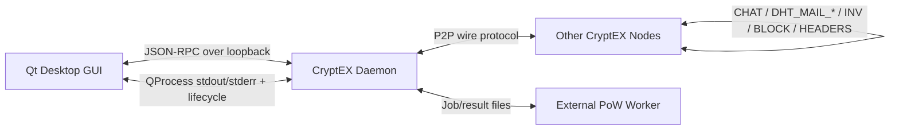

# CryptEX Communication Systems

This document is a technical overview of the current communication systems implemented in CryptEX as of the `v0.6.x` line. It focuses on how the node, desktop client, worker processes, and user-facing messaging features communicate, what protocols exist between them, and what hardening work landed recently.

CryptEX does not have a single communication layer. It has several distinct planes:

1. a peer-to-peer node transport for chain sync, transaction relay, discovery, and mailbox routing
2. a local RPC control plane for the GUI, operator tools, and wallet workflows
3. a local GUI-to-daemon orchestration path for startup, attach, and recovery
4. an external proof-of-work worker protocol between the daemon and dedicated miner binaries
5. an application-layer secure messaging stack for chat, voice relay, and P2P mail

## System Map

## 1. Peer-to-Peer Transport

The core network transport lives in `src/network.hpp` and `src/network.cpp`. It is a long-running TCP node service with explicit message typing, peer session state, headers-first synchronization, peer discovery, and application-level relay logic for secure messaging features.

### Message Families

The wire protocol defines several families of messages:

- node handshake and liveness:
  - `VERSION`
  - `VERACK`
  - `PING`
  - `PONG`
- blockchain synchronization:
  - `GETHEADERS`
  - `HEADERS`
  - `GETBLOCK`
  - `BLOCK`
- peer discovery and address exchange:
  - `GETPEERS`
  - `PEERS`
- transaction and inventory relay:
  - `INV`
  - `GETTX`
  - `TX`
- application-layer messaging:
  - `CHAT`
- mining control messages:
  - `GETWORK`
  - `SUBMITWORK`
- distributed mail control:
  - `DHT_MAIL_STORE`
  - `DHT_MAIL_FIND`
  - `DHT_MAIL_RESULTS`
  - `DHT_MAIL_RECEIPT`
  - `DHT_MAIL_CHALLENGE`
  - `DHT_MAIL_PROOF`
  - `DHT_MAIL_NAT_INTRO`

This split is important because CryptEX treats chain sync, mail routing, voice signaling, and local mining as separate communication domains even when they ride through the same node process.

### Headers-First Sync

Chain synchronization is headers-first rather than blind block flooding. In practice that means:

- peers announce chain state and header progress first
- the local node tracks:
  - local best height
  - best peer height
  - queued block downloads
  - inflight block downloads
  - connected peers
  - validated peers
- the node only downloads missing blocks once it has enough structure to schedule them sanely

This gives the GUI a more accurate view of whether the node is locally caught up, still syncing, or simply has no validated peers yet.

### Discovery and Bootstrap

CryptEX has multiple discovery paths so a node is not dependent on a single bootstrap mechanism:

- DNS seeds for initial peer discovery
- LAN discovery over UDP broadcast
- explicit direct-peer targets from config or GUI
- remembered peers from prior runs
- optional SOCKS5 proxy support for outbound connections
- optional external endpoint detection and port mapping

The daemon logs these steps explicitly:

- `LAN discovery listening on UDP ...`
- `discovered LAN peer=...`
- `resolved seed=...`
- `public ip detection failed ...`

That visibility matters because CryptEX is often run on small private networks, dev networks, or single-node environments where discovery behavior changes how the wallet interprets sync confidence.

### NAT, Proxying, and Reachability

The node has first-class support for:

- SOCKS5 proxy configuration with optional remote DNS resolution
- public endpoint detection
- port mapping status reporting
- DHT mail NAT assist and relay fallback
- STUN-assisted reflexive endpoint reporting for mail transport

This matters because CryptEX’s communication systems are not limited to chain data. Secure chat, voice relay, and distributed mail need a node to reason about when direct reachability is possible and when relay or introduction flows are required.

## 2. RPC Control Plane

The RPC service in `src/rpc.hpp` and `src/rpc.cpp` is the main local control surface for the GUI and operator tooling.

### RPC Design

The service is designed as a local-first control plane:

- default bind: `127.0.0.1`
- default transport: HTTP JSON-RPC
- optional TLS with locally generated certificates
- basic-auth credentials plus `rpcauth` entries
- allowlist-based IP controls
- request body limits and rate limiting

For TLS mode, CryptEX generates local certificates with SAN coverage for:

- `localhost`
- `127.0.0.1`
- `::1`

That makes the local desktop integration secure without requiring external certificate provisioning.

### RPC Surface Area

The RPC layer exposes much more than just blockchain primitives. It is the operational bridge for:

- blockchain and node inspection
  - `getblockchaininfo`
  - `getnetworkinfo`
  - `getpeergraph`
  - `getpeerinfo`
  - `getportmappinginfo`
  - `getmininginfo`
- submission and mining control
  - `submitblock`
- secure messaging
  - `resolvechatrecipient`
  - `getpublicaddressdirectory`
- voice relay
  - `getvoicecallstate`
  - `startvoicecall`
  - `acceptvoicecall`
  - `declinevoicecall`
  - `endvoicecall`
  - `sendvoicecallaudio`
  - `pullvoicecallaudio`
- P2P mail
  - `getp2pmailaccounts`
  - `resolvep2pmailrecipient`
  - `getp2pmail`
  - `sendp2pmail`
  - `deletep2pmail`
  - `getp2pmailproxyconfig`
  - `setp2pmailproxyconfig`
  - `getp2pmailsecurity`
  - `setp2pmailsecurity`
  - `verifyp2pmail2fa`
  - `getp2pmailpolicy`
  - `setp2pmailpolicy`

This makes the daemon the true communications coordinator. The GUI is mostly a controller and presentation layer rather than a second protocol implementation.

### Recent RPC Hardening

Recent work in the `v0.6.x` line tightened the RPC path in ways that matter specifically for communication features:

- local GUI traffic no longer self-throttles during mined-block reconciliation
- localhost is exempt from the generic HTTP rate limiter
- remote clients still remain rate-limited
- clearer backend-start and attach failure states now surface to the GUI instead of looking like sync stalls

That change removed an ugly failure mode where the GUI could flood itself with `HTTP 429` errors while replaying locally mined blocks back into the backend.

## 3. GUI-to-Daemon Orchestration

The Qt desktop client does not embed full node logic. Instead it launches and controls the backend daemon through `QProcess`, then attaches to it over RPC once the service is live.

### Launch Flow

The GUI launch configuration includes:

- daemon executable path
- selected network
- datadir
- RPC bind and port
- RPC credentials
- wallet path and password
- optional direct peers
- optional seed targets
- debug mode

The GUI then:

1. starts the daemon process
2. tails merged stdout and stderr
3. waits for RPC readiness
4. attaches over loopback JSON-RPC
5. updates desktop state from live RPC results

### Why This Split Matters

This architecture gives CryptEX a clean fault boundary:

- GUI bugs do not redefine consensus
- the daemon remains the source of truth for chain state
- operator tooling can talk to the same backend without duplicating logic
- startup and repair failures can be reported precisely from backend logs

### Recent Desktop Communication Fixes

Several recent fixes landed in this orchestration path:

- backend launch failures no longer leave the GUI stuck in an endless “starting” state
- port conflicts now fail cleanly instead of causing aggressive restart loops
- stale startup replay items are no longer retried forever after a hard rejection
- the app distinguishes better between:
  - local backend connectivity
  - peer sync progress
  - wallet approval state

That work matters because the desktop experience is only as trustworthy as the communication contract between the GUI and daemon.

## 4. External PoW Worker Protocol

CryptEX now treats proof-of-work search as a separate communication problem too.

The daemon computes canonical headers and targets, then hands nonce-search work to an external worker binary. That worker is not allowed to define consensus. It only searches nonce ranges and returns results.

### Protocol Shape

The worker protocol is file-based and explicit:

- job magic: `CRXPOW2!`
- result magic: `CRXRES2!`

Job payload:

- 80-byte serialized block header
- 64-byte expanded target
- start nonce
- nonce step
- max iterations

Result payload:

- found flag
- winning nonce
- iteration count
- 64-byte SHA3-512 hash

### Why This Matters

This split gives CryptEX several benefits:

- platform-specific worker implementations can evolve without changing consensus
- the daemon remains the only authority that decides whether a found block is valid
- worker crashes or malformed outputs are isolated to the mining pipeline
- non-ARM platforms can still participate fully even when they do not use the ARM64 handwritten assembly path

### Platform Matrix

Current worker backends are:

- macOS ARM64:
  - dedicated handwritten ARM64 assembly worker
- Linux ARM64:
  - dedicated handwritten ARM64 assembly worker
- Linux x86_64:
  - external worker with a dedicated x86_64 batched backend and AVX2 compare path
- Windows x86_64:
  - external worker with the same dedicated x86_64 batched backend and AVX2 compare path

Across every platform:

- the daemon computes the canonical target from `bits`
- the worker performs nonce search only
- the daemon re-validates the candidate block before chain acceptance

That last point is the safety line: a worker finding a valid PoW hash is necessary, but not sufficient, for a block to become chain state.

## 5. Secure Chat Transport

CryptEX’s chat system sits on top of the node transport but is treated as a proper protocol layer of its own.

### Chat Types

Application chat payloads support several modes:

- public chat
- private chat
- voice control messages
- voice frame transport
- mail payloads

### Security Model

Private communication uses authenticated payloads with:

- signed metadata
- timestamps and nonces
- transport-type tagging
- sender and recipient addressing
- content envelopes for attachments and rich media

Encryption modes:

- `ECDH`
- `RSA`

The current private transport uses:

- secp256k1-based ECDH where appropriate
- RSA-OAEP for wrapped-session-key mode
- AES-GCM payload encryption
- signed payload envelopes

The KDF profile is also versioned. Current code supports:

- legacy SHA3 derivation
- PBKDF2
- scrypt
- Argon2id

That gives the system a migration path for stronger private transport without breaking older payload handling.

### Address-First UX

CryptEX is address-first rather than username-first:

- the GUI resolves contacts from chain-known addresses and saved contact metadata
- `resolvechatrecipient` returns enough data to decide whether:
  - public messaging is possible
  - ECDH private messaging is possible
  - RSA private messaging is possible

That resolution flow is part of the communication system, not just a UI convenience. It is what lets users move from raw addresses to secure direct messaging without maintaining a separate centralized directory.

## 6. Voice Relay

Voice relay is built as a structured extension of the private messaging stack rather than a completely separate subsystem.

### Signaling

Voice session setup rides through chat control messages. The main signal types are:

- `Offer`
- `Answer`
- `Decline`
- `Hangup`

The call signal carries:

- caller and callee addresses
- peer label
- caller public key material
- encryption mode
- sample rate
- channel count
- bits per sample
- frame duration
- codec name
- feature flags

### Media Path

Audio frames carry:

- timestamp
- sequence
- call ID
- sample rate and channel metadata
- codec indicator
- IV
- authentication tag
- encoded audio bytes

Current media design:

- ECDH-derived session key
- AES-GCM encrypted frames
- Opus codec for live transport
- optional voice-cloak processing
- no durable call history as part of the live relay path

This is one of the more interesting communication systems in CryptEX because it turns the same node transport into a low-latency, application-aware secure media relay without creating a second daemon.

## 7. P2P Mail and Distributed Relay

P2P mail is the most complex communication subsystem in the current tree. It behaves like a distributed mailbox overlay on top of the node graph.

### Mail Addressing

CryptEX supports address resolution for mail recipients through:

- wallet addresses
- alias-style mail addresses such as `user@p2pmail.crx`

The RPC layer resolves those targets into communication-ready recipient data.

### DHT-Style Mail Messages

Mail uses dedicated network message types for distributed store-and-forward behavior:

- `DHT_MAIL_STORE`
- `DHT_MAIL_FIND`
- `DHT_MAIL_RESULTS`
- `DHT_MAIL_RECEIPT`
- `DHT_MAIL_CHALLENGE`
- `DHT_MAIL_PROOF`
- `DHT_MAIL_NAT_INTRO`

That means mail is not just “chat, but slower.” It has its own relay, receipt, proof, and recovery flows.

### Mail Policy Surface

The mail policy system can be configured through RPC and GUI pages with controls for:

- TTL hours
- replica target
- maximum store items
- pruning rules
- proof-of-storage enablement
- challenge interval
- minimum bond
- required verified replicas
- slashing on failed proof
- slash penalty score
- NAT assist
- relay fallback
- dedicated relay peers
- STUN servers
- STUN timeout

### Why This Design Matters

This turns the node graph into a communication fabric that can carry:

- encrypted direct mail
- replicated inbox storage
- delivery receipts
- proof challenges for distributed storage accountability
- NAT introductions when direct routes do not exist

That is substantially more advanced than a simple wallet chatbox, and it is one of the main reasons CryptEX’s communication stack deserves to be documented as a system rather than as a feature list.

## 8. Public Directory and Presence

CryptEX also exposes a public address directory over RPC for UI workflows.

The directory is built from:

- chain-observed addresses
- saved contact metadata
- live node knowledge such as peer labels and observed reachability

This gives the communication stack a discovery layer that is still compatible with the project’s address-first model.

In practice, it lets the GUI do things like:

- open a private chat from a known address
- resolve whether a recipient has ECDH or RSA material
- pivot from an address into mail composition
- attach peer and presence hints without inventing a centralized identity server

## 9. Operational Hardening in the Latest Cycle

The latest communication-focused work in CryptEX was less about adding one brand-new protocol and more about making the existing planes cooperate correctly under failure.

### Communication-Adjacent Improvements

- GUI startup now handles backend failure, busy ports, and attach timing more honestly
- localhost RPC no longer trips generic rate limits during local replay workflows
- stale replayed mined blocks are discarded after hard rejection instead of looping forever
- startup repair now truncates invalid active chain tails caused by stale `bits` or missing canonical blocks
- approval logic behaves more sanely on peerless and local-only nodes
- difficulty rescue logic was changed so emergency min-difficulty blocks do not destabilize later communication between miners and the canonical chain rules

These are not cosmetic. They are all examples of communication boundaries that previously leaked bad state:

- GUI <-> daemon
- miner <-> daemon
- peer sync state <-> wallet approval
- stale local replay queues <-> live RPC service

## 10. Architectural Takeaways

A useful way to think about modern CryptEX is this:

- consensus is a correctness core
- communication systems are the glue that makes that core usable

The current implementation leans hard into explicit boundaries:

- the GUI controls but does not redefine the daemon
- the daemon validates but does not blindly trust workers
- P2P transport carries multiple protocol families without collapsing them together
- secure messaging features reuse the node graph instead of outsourcing identity and transport
- mail and voice are layered extensions of the same address-first communication model

That structure is what allowed recent hardening work to land in focused places instead of turning into a full rewrite.

## 11. Current Limits

The current design is strong, but a few areas are still clearly next-step engineering work rather than finished doctrine:

- public IP autodetect remains noisy on some networks
- x86_64 worker backends now have dedicated batching and AVX2 compare paths, but they are still not handwritten SHA3 assembly kernels like the ARM64 workers
- wallet approval UX is still stricter and more confusing than it should be in small private networks
- communication status in the GUI can still look healthier than the actual peer graph if the node is locally caught up but not externally validated

Those are fixable issues, and they are now visible because the architecture has become explicit enough to diagnose them cleanly.

## Summary

The latest communication systems in CryptEX are not one feature. They are a layered set of protocols and control surfaces:

- peer-to-peer node transport
- secure loopback RPC
- GUI/backend lifecycle orchestration
- external PoW worker communication
- encrypted public and private chat
- live voice relay
- distributed P2P mail with relay and proof flows
- address-directory resolution across the stack

That combination gives CryptEX a much more ambitious communications profile than a typical single-purpose cryptocurrency node. The important part is that the communication stack is now explicit, inspectable, and increasingly hardened against the kinds of state drift and ambiguity that previously caused confusing behavior during mining, startup, and recovery.
